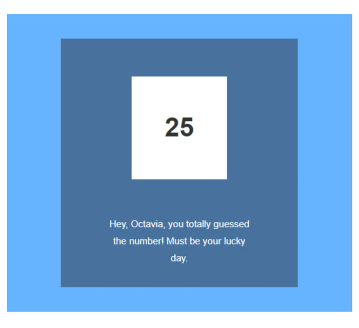

<h1><strong>Number Guessing Game</strong></h1>

<h2>Overview</h2>

The program generates a random number, accepts a number guess from the user and gives feedback on their guess compared to the magic number. However, there were some errors with the program that needed to be figured out for the code to function properly.

<h4>JavaScript & Skills Utilized:</h4>

* Using the console to discover errors 
* Troubleshooting
* Debugging
* Math object

<h4>Other JS features include:</h4>

* prompt() & Number()
* querySelector()
* Function Expressions
* response.innerText
* Math.floor(Math.random()

